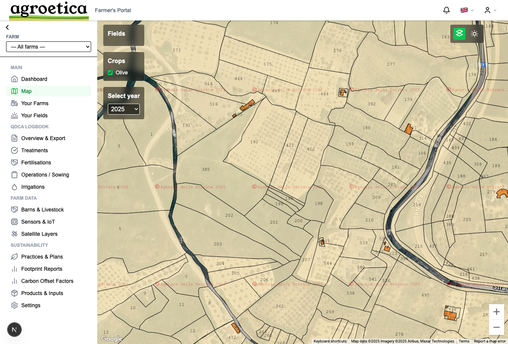
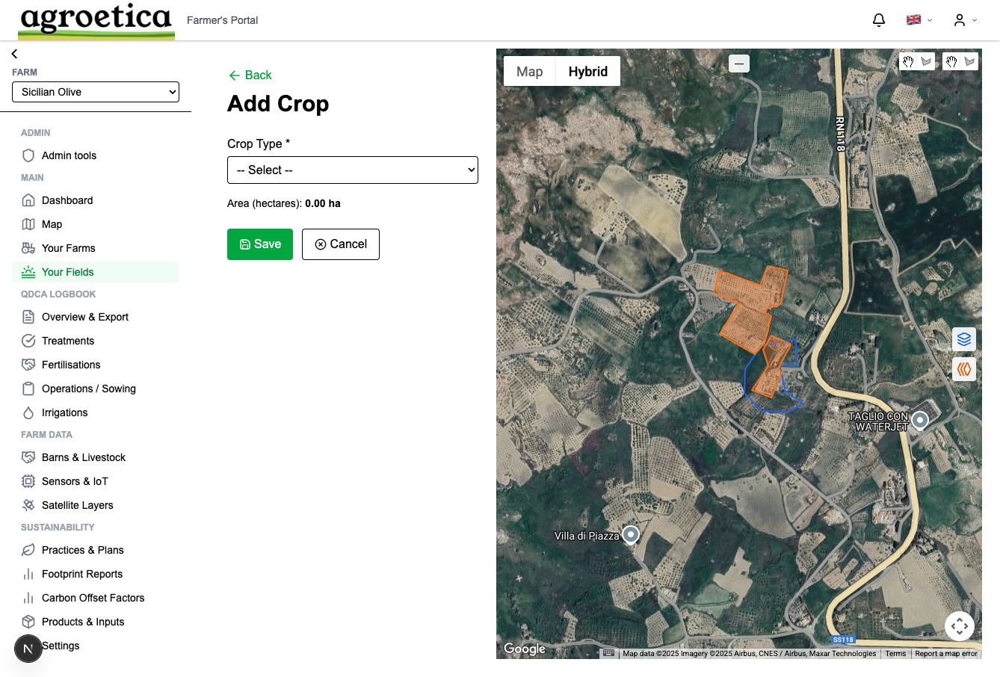
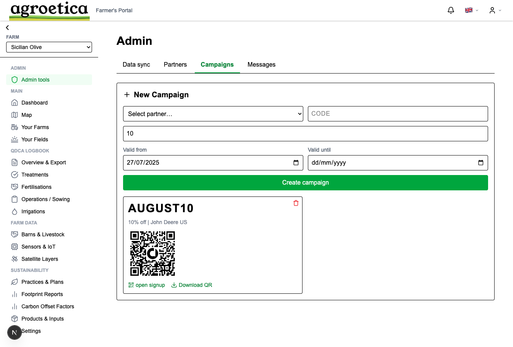

# 🌱 Agroetica — Frontend Platform for Regenerative Farm Compliance

**Agroetica** is a full-stack agentic platform for sustainable agriculture, delivering near real-time compliance insights to regenerative farms using Sentinel-2 satellite data, GenAI, and scalable cloud infrastructure.

This repo contains the **frontend web platform** built in **Next.js** — supporting insight visualisation, offline-first functionality, and a modular architecture designed for rapid iteration and AI agent integration.

> 🛰️ Built for real-world diagnostics. Designed for scale. Powered by GenAI.

## Screenshots
### Dashboard View


### Crop Management View


### Admin Panel


---

## 🧭 Core Features

- 🌍 **Geospatial Insights** – Visualise Sentinel-2 vegetation indices (NDVI, NDWI, BSI) to detect treatment violations
- 🧠 **GenAI Agents** – Embedded retrieval-augmented agents for natural language compliance queries
- 📶 **Offline-Capable PWA** – Service worker caching, sync strategy, and mobile-first UX for rural environments
- 🧰 **Admin & Internal Tools** – QR-based sample tracking, audit logs, crop health alerts
- 🧪 **Modular UI Architecture** – Built for rapid prototyping and integration with backend APIs

---

## 🏗️ Tech Stack

| Layer              | Tech Used                                 |
|--------------------|--------------------------------------------|
| Frontend Framework | **Next.js**, TypeScript, React             |
| State Management   | React Context, SWR                         |
| Styles & UI        | Tailwind CSS, Headless UI, Geist Font      |
| Data Fetching      | API Routes, GraphQL Integration (planned) |
| Offline Strategy   | Service Workers, Cache API                |
| Deployment         | Vercel + GitHub Actions CI/CD             |

---

## 🧪 Local Development

Clone the repo and install dependencies:

```bash
git clone https://github.com/castillofranciscoj/agroetica-fe
cd agroetica-fe
npm install
```

Start the local dev server:

```bash
npm run dev
```

Open http://localhost:3000 to view the app.

---

## Folder Structure

```plaintext
📦 agroetica-fe/
├── app/                # App directory (Next.js App Router)
├── components/         # Reusable UI components
├── lib/                # Utility functions, API clients
├── public/             # Static assets (icons, screenshots)
├── styles/             # Tailwind base styles
├── docs/               # Screenshots, diagrams, technical notes
└── ...
```


## 👨‍💻 About the Author

**Francisco Castillo**  
Senior Software Engineer | GenAI & Platform Architecture | MBA Imperial College  
🌍 London-based | 🇬🇧 Permanent Resident  
🔗 [linkedin.com/in/franciscojcastillo](https://linkedin.com/in/franciscojcastillo)

> _Building secure, intelligent platforms to power systems change — from AgTech to LegalTech and beyond._

---


